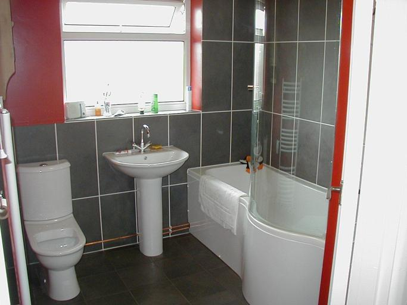
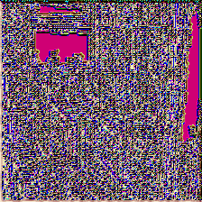
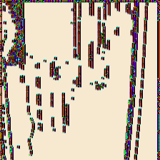
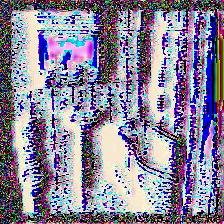

lization-vgg16
使用 [visualizing and understanding convolutional networks](https://link.springer.com/chapter/10.1007/978-3-319-10590-1_53) 论文里提到的 deconv network 对 [vgg16](http://ethereon.github.io/netscope/#/preset/vgg-16) 进行可视化

note:
1. the base vgg16 construct source code is from [https://github.com/machrisaa/tensorflow-vgg](https://github.com/machrisaa/tensorflow-vgg)
2. before you start the script file, you should do somethings following:
>1. download the vgg16.npy from [later update](later update) for china and [https://mega.nz/#!YU1FWJrA!O1ywiCS2IiOlUCtCpI6HTJOMrneN-Qdv3ywQP5poecM](https://mega.nz/#!YU1FWJrA!O1ywiCS2IiOlUCtCpI6HTJOMrneN-Qdv3ywQP5poecM) for other countries.
>2. mkdir a input dir, and put a image named "test.jpg" for the input image.
>3. mkdir a output dir for the output images.

3. to start the script, you just to type `python visiualization_vgg16.py which_gpu_device_to_use`.
4. if you have no gpus, just comment the `os.environ["CUDA_VISIBLE_DEVICES"]=sys.argv[1]` in the script.

some examples:
input image:

visualization results:

